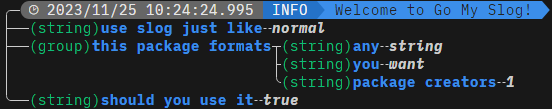
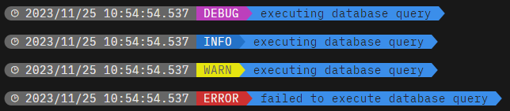

# go-my-slog


#### A Go slog wrapper to make formatting your logs personalized and interpretable

## Usage
To add this package to your project:
```go get github.com/stevohuncho/go-my-slog```

## Setup
```go
handler := gomyslog.NewHandler(os.Stdout,
    gomyslog.SlogHandlerOpt(slog.HandlerOptions{
        Level: slog.LevelDebug,
    }),
)
slog.SetDefault(slog.New(handler))
```

## Styling
```go
type Styling struct {
	StylingColors
	StylingChars
	showType    bool
	showTime    bool
	maxValueLen int
}
```
| **Option**        | **Desc**                                                                                     | **Default** |
|-------------------|----------------------------------------------------------------------------------------------|-------------|
| **StylingColors** | The color schemes used for each component of the logging format                              | Shown below |
| **StylingChars**  | The characters used for each component of the logging format                                 | Shown below |
| **showType**      | If true the type of each slog component is show in the output                                | true        |
| **showTime**      | If true the time the log was printed is shown in the header of the log                       | true        |
| **maxValueLen**   | The max number of characters that can be printed in a single line for a slog.Attribute value | 50          |
```go
type StylingColors struct {
	level  LevelColorMap
	time   Colors
	prefix Colors
	msg    Colors
	typing Colors
	key    Colors
	value  Colors
	tree   Colors
	ktov   Colors
}

type StylingChars struct {
	leftCap      string
	rightCap     string
	rightArrow   string
	topCurve     string
	bottomCurve  string
	t            string
	sideT        string
	dash         string
	l            string
	topCorner    string
	bottomCorner string
	dottedDash   string
	dottedL      string
}
```
### How to customize Styling
```go
myCustomStyling := gomyslog.Styling{
    StylingColors: gomyslog.StylingColors{...},
    StylingChars:  gomyslog.StylingChars{...},
    ShowType:      false,
    ShowTime:      false,
    MaxValueLen:   100,
}
handler := gomyslog.NewHandler(os.Stdout,
    gomyslog.SlogHandlerOpt(slog.HandlerOptions{
        Level: slog.LevelDebug,
    }),
    gomyslog.StylingHandlerOpt(myCustomStyling),
)
slog.SetDefault(slog.New(handler))
```

## Custom Slog Functions
### Prefix
```go
slog.Info("heres how you can use the prefix", gomyslog.Prefix("TEST"))
```


## Feedback
Add your issue here on GitHub. Feel free to get in touch if you have any questions.